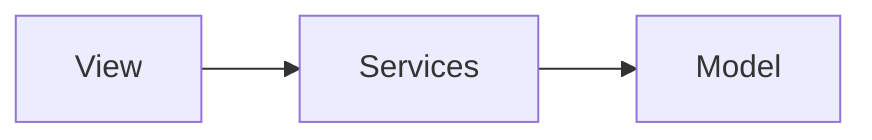
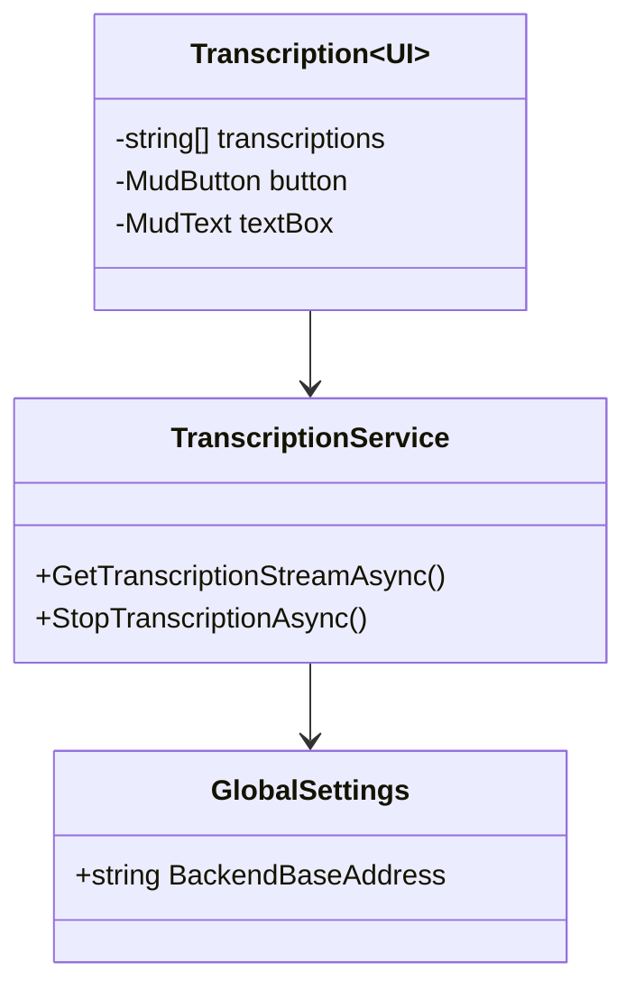

# Frontend

This is the frontend of the project. It is a [MudBlazor](https://mudblazor.com/) project; it is a multi-page application that uses [Blazor](https://dotnet.microsoft.com/apps/aspnet/web-apps/blazor) to render the UI. The frontend is designed to be a thin client that communicates with the backend via a REST API.

## Requirements

- [.NET 8.0](https://dotnet.microsoft.com/download/dotnet/8.0)

## Running

To run the frontend, run the following command:

```bash
cd frontend
./startup.sh
```

## Design

The frontend uses a slightly modified [Model-View-ViewModel](https://en.wikipedia.org/wiki/Model%E2%80%93view%E2%80%93viewmodel) architecture. The `Model` is any data template that is used by the frontend. An example of a `Model` is a `GlobalSettings` object that contains the settings for the entire application. They are used by both the `View` and the `ViewModel` (`Service`).

The `ViewModel` has been replaced by `Services`, which are classes that handle the logic of the frontend. The `Services` are responsible for interacting with the backend, configuring the system, abstracting business logic, etc. The `Services` are injected into the `View` via [dependency injection](https://docs.microsoft.com/en-us/aspnet/core/fundamentals/dependency-injection?view=aspnetcore-5.0)

The `View` is the UI that is rendered by the frontend, which is written in [Razor](https://docs.microsoft.com/en-us/aspnet/core/mvc/views/razor?view=aspnetcore-5.0). It is responsible for rendering the `Model` and calling the appropriate `Services` when the user interacts with the UI.

The following diagram shows the relationship between the `Model`, `View`, and `Services`:



The following is the class diagram for the frontend:



The diagram above shows an example of a `View` that uses a `Service` to interact with the backend. The `TranscriptionService` is responsible for interacting with the backend, and the `Transcription<UI>` is responsible for rendering the UI. The `Transcription<UI>` uses the `TranscriptionService` to interact with the backend. The `TranscriptionService` uses the `GlobalSettings` model to determine the address of the backend.

> Note: The `<UI>` suffix is used to denote that the class is a UI component (view tier).
> Note: The `GlobalSettings` model is maintained automatically by the [Options pattern](https://docs.microsoft.com/en-us/aspnet/core/fundamentals/configuration/options?view=aspnetcore-5.0).

### File Structure

The frontend is structured as follows:

```bash
frontend
├── startup.sh           # Startup script
├── Program.cs           # Entry point
├── Models               # Models
├── Services             # ViewModels
├── Pages                # Views
├── Shared               # Shared UI components
└── wwwroot              # Static files
   └── appsettings.json  # Configuration file
```
