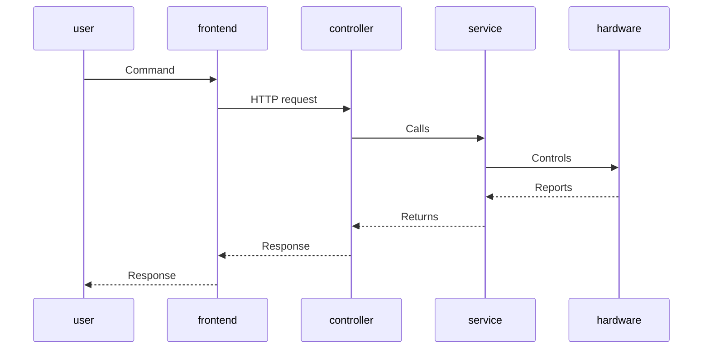
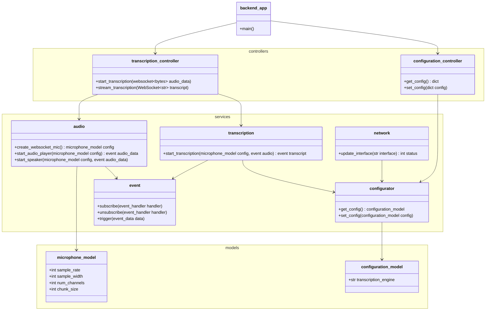
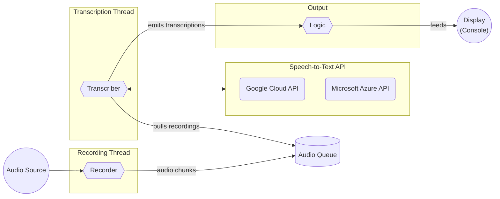
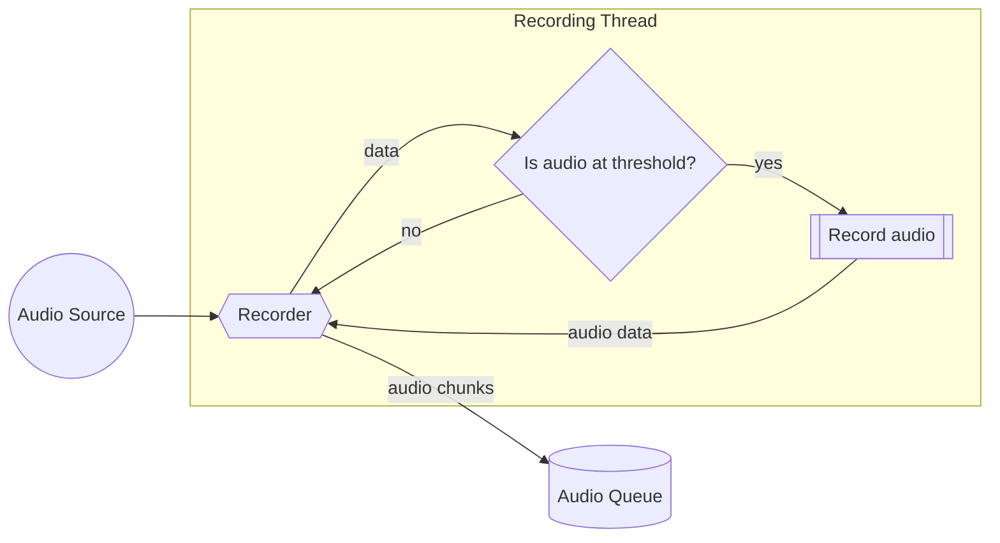
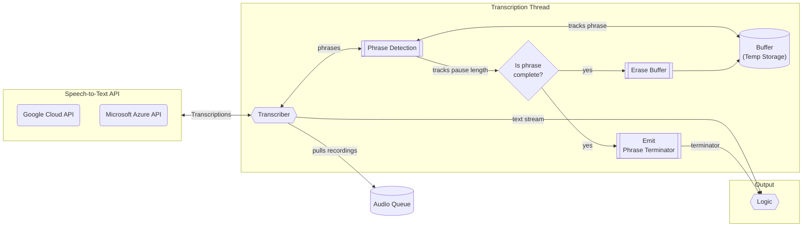
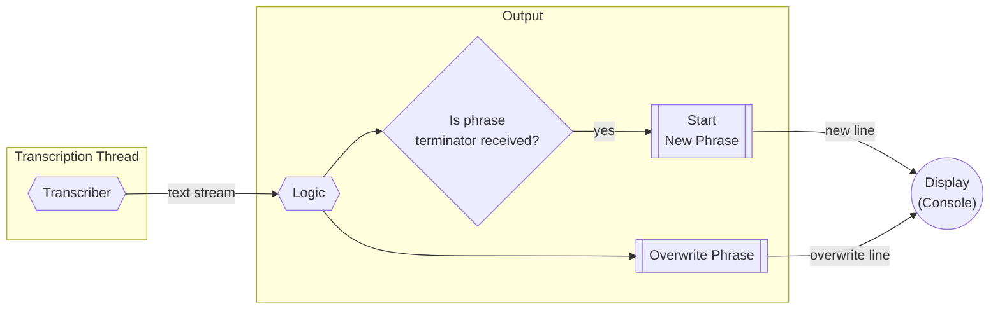
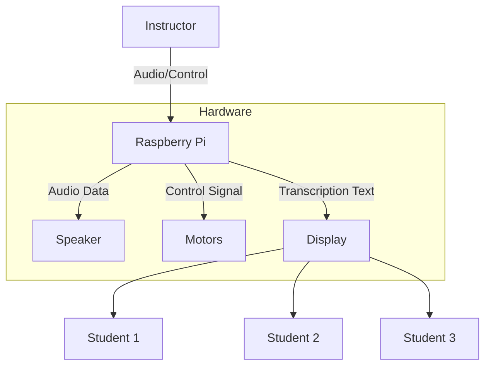

# Backend

The backend of the project is responsible for the following:

- Controlling the robot's hardware
- Configuring the robot

The project is written in Python, and uses the [FastAPI](https://fastapi.tiangolo.com/) framework to provide a REST API for interfacing with the robot.

## Requirements

- [Python >=3.12](https://www.python.org/downloads/release/python-370/)

## Development Setup

```sh
cd software/backend             # change directory to the backend
python3 -m venv .venv           # create a virtual environment
source .venv/bin/activate       # activate virtual environment
pip install -r requirements.txt # install dependencies
./startup.py --debug            # start the backend server in debug mode
```

Test the backend by sending a request to the server:

```sh
curl -i -X GET http://localhost:9600/
```

Which results in the following response:

```http
HTTP/1.1 200 OK
date: Sat, 02 Dec 2023 03:28:30 GMT
server: uvicorn
content-length: 21
content-type: application/json

{"message":"Running"}
```

## Design

The backend is designed to be modular, with each component being responsible for a specific task. The following components are included:

- **Interfaces (frontend)**: They are responsible for providing a method of communication with the backend; captures user commands and sends them to the backend, and displays responses from the backend. These can include a web interface, a command-line interface, or a wireless controller.
- **Controllers**: These are the endpoints that the frontend communicates with. They are responsible for translating frontend commands into backend commands, and for returning responses to the frontend. They define the project's API.
- **Services**: These are the components that are responsible for executing backend commands. They are responsible for controlling the robot's hardware, and for configuring the robot. These define the core logic of the project.



### Backend Application

The backend application is responsible for routing requests to the appropriate controller, which then calls the appropriate services. The following is a class diagram of the backend application:



### Live Transcription

Live transcription is a feature that allows the robot to transcribe speech in real-time. It's implemented using the following components:



#### Audio Recording



#### Transcription



#### Output




**Transcription process:**

1. **Audio Source**: An audio receiver or microphone continuously captures audio.
2. **Recording Device**: It listens to the audio source in the background and stores recordings.
3. **Queue of Recordings**: A queue that holds all the audio recordings to be processed, operating in a different thread from the main application.
4. **Transcriber**: This component continuously transcribes the recordings from the queue.
5. **Temporary File (Buffer)**: A buffer that accumulates audio data, waiting for pauses that signal the end of phrases.
6. **Phrase Detection**: Within the transcriber, phrase detection logic determines when a phrase is complete based on pauses in speech.
7. **Ongoing Transcription**: The transcriber continuously transcribes the audio, allowing for self-correction as new audio data is received.
8. **Phrase Output**: Once a phrase is locked-in, it's emitted separately from the ongoing transcription.
9. **Console Output**: The last transcription is continuously overwritten until a phrase separator is emitted, at which point a new line is started for a new phrase on the console.

### File Structure

The backend is structured as follows:

```bash
software/backend
├── .env                # Environment variables
├── setup.sh            # Setup script for development
├── startup.py          # Entry point
├── requirements.txt    # Dependencies
├── data/               # Data files, including logs and configuration
└── app/                # Backend application
    ├── main.py         # Backend entry point
    ├── models/         # Models of data objects (without logic)
    ├── controllers/    # API endpoints
    └── services/       # Core logic
```

### Dataflow


