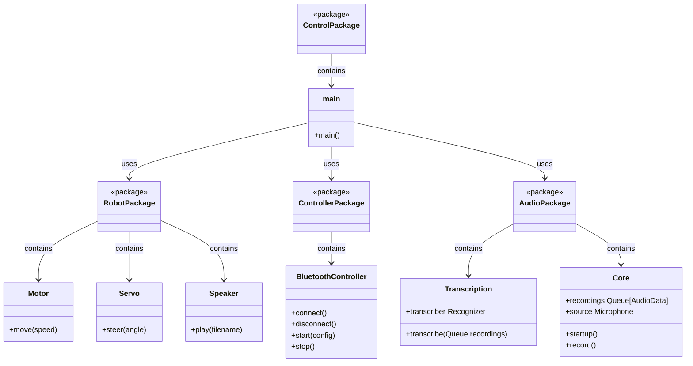
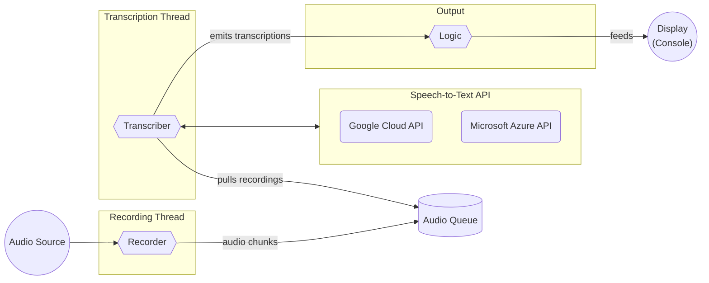
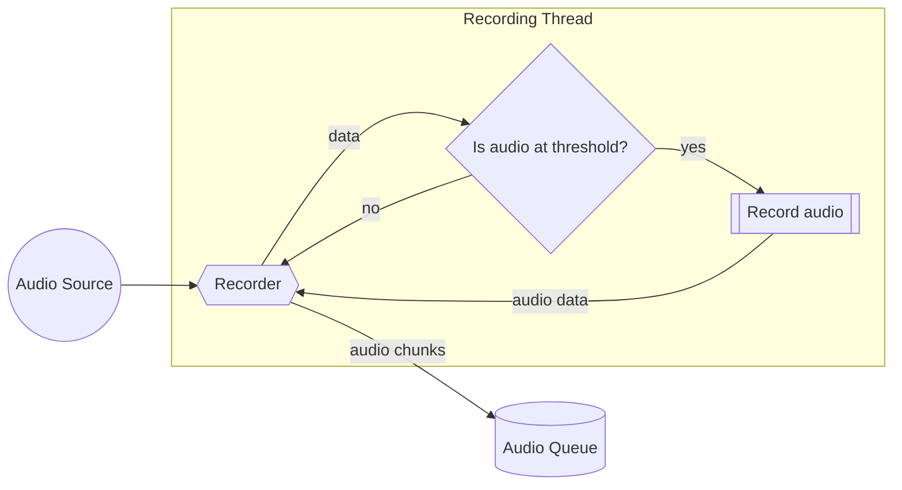
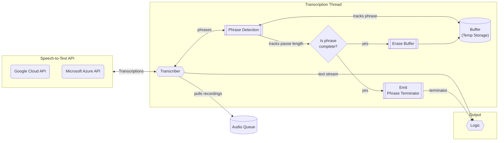
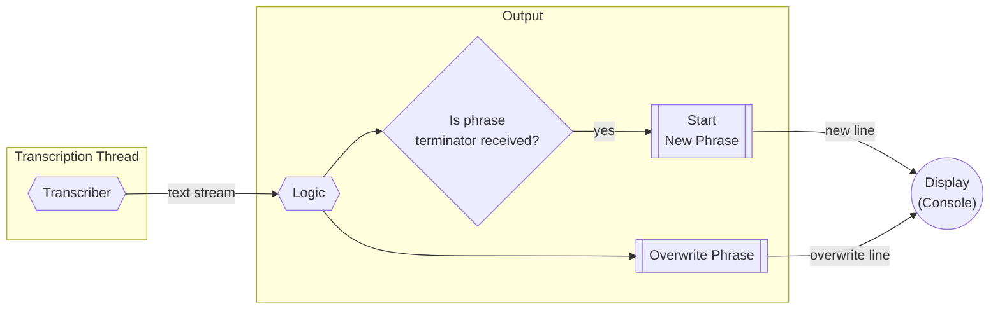

# Backend

## Overview

The backend is responsible for controlling the robot and the Raspberry Pi. It consists of different endpoints that are exposed locally. The endpoints are used by the frontend to control the robot and the Raspberry Pi.

## Requirements

- [Python >=3.11](https://www.python.org/downloads/release/python-370/)

## Development Setup

```sh
./setup.sh
source venv/bin/activate
./startup.py --debug
```

## Design



### Live Transcription



#### Audio Recording



#### Transcription



#### Output




**Transcription process:**

1. **Audio Source**: An audio receiver or microphone continuously captures audio.
2. **Recording Device**: It listens to the audio source in the background and stores recordings.
3. **Queue of Recordings**: A queue that holds all the audio recordings to be processed, operating in a different thread from the main application.
4. **Transcriber**: This component continuously transcribes the recordings from the queue.
5. **Temporary File (Buffer)**: A buffer that accumulates audio data, waiting for pauses that signal the end of phrases.
6. **Phrase Detection**: Within the transcriber, phrase detection logic determines when a phrase is complete based on pauses in speech.
7. **Ongoing Transcription**: The transcriber continuously transcribes the audio, allowing for self-correction as new audio data is received.
8. **Phrase Output**: Once a phrase is locked-in, it's emitted separately from the ongoing transcription.
9. **Console Output**: The last transcription is continuously overwritten until a phrase separator is emitted, at which point a new line is started for a new phrase on the console.
