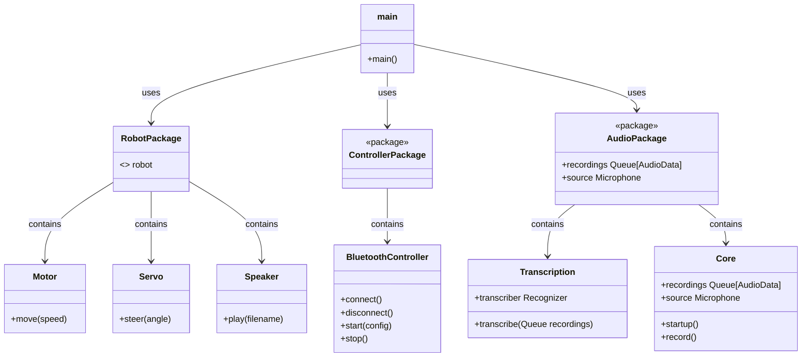

# Control Software

This program is responsible for controlling the robot. It is written in Python
and is designed to run on a Raspberry Pi 4.

## Requirements

- [Python >=3.11](https://www.python.org/downloads/release/python-370/)

## Development Setup

```bash
./setup.sh
source .venv/bin/activate
```

## Design


